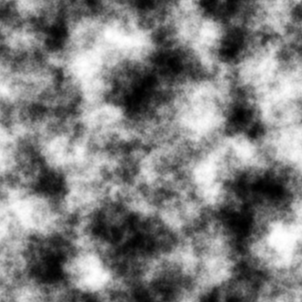
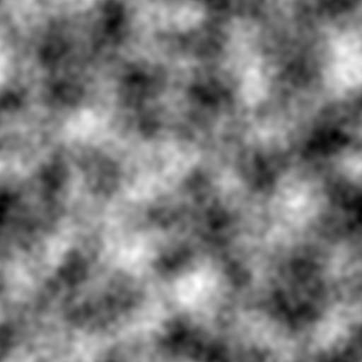
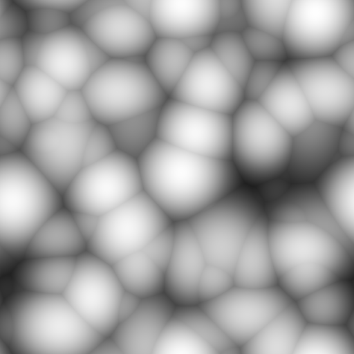
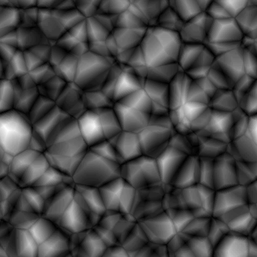
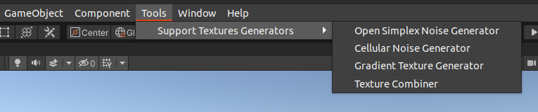
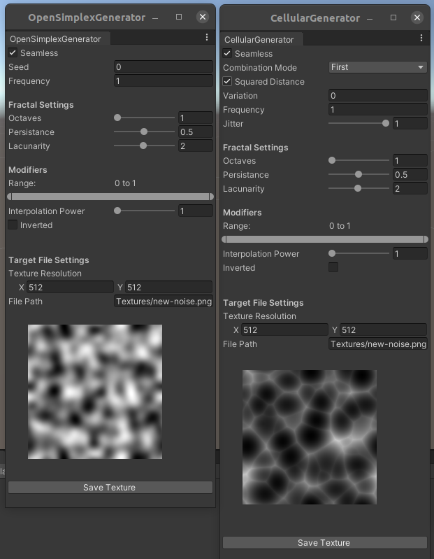
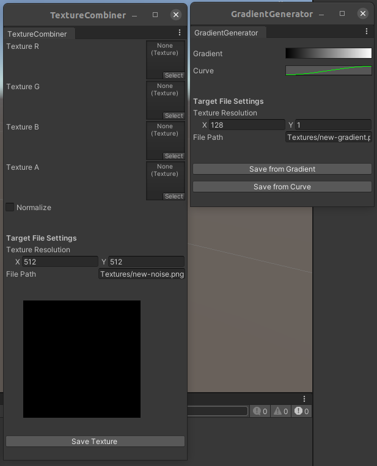

# Unity Support Textures Generators

 

 

This project is a compilation of tools to generate useful textures like seamless noise, gradients and tools to modify them. It's very common to use them in shaders or other procedural generation, so I think having tools to deal with them directly in Unity would be of great use. They are all MIT, so feel free to use it as is, improve it or adapt it as you wish. The noise generation code is not tied to the tools and can be easily used in other procedural generation needs you may have, but if you just want the noise, check the Credits section where you can have more data about them.

## Instructions

Just put all files on [Assets/Editor](source/Assets/Editor), and [Assets/Scripts](source/Assets/Scripts) on your project. A new option on Unity's editor menu should show up.

Just click any of them and a new editor window should pop up for you to use it.

## Credits

All of this would never be possible without the awesome open source community. None of the noise generation algorithms used are mine.
- [KdotJPG](https://github.com/KdotJPG/OpenSimplex2) for this great Open Simplex noise generation code.
- [Justin (Scrawk)](https://github.com/Scrawk/GPU-Voronoi-Noise) for this awesome Voronoi noise generation code.
- The implementation and everything else was done by me, [Rafael Bordoni](https://github.com/eldskald).
